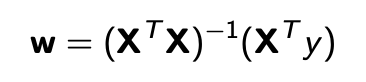

# Linear Regression Models

Linear regression attempts to model the relationship between two variables by fitting a linear equation to observed data.

Here, we are experimenting with three different algorithms to train linear regression models: solving normal equations, batch gradient descent, and stochastic gradient descent.

## The Normal Equation

Solving for w using the following equation:



In order to run the program, run the following command:

```
python3 normal_equation.py
```

## Batch Gradient Descent (BGD)

Solving for w using the following algorithm:


In order to run the program, run the following command:

```
python3 batch_gradient_descent.py
```

## Stochastic Gradient Descent (SGD)

Solving for w using the following algorithm:


In order to run the program, run the following command:

```
python3 stochastic_gradient_descent.py <options>
```

The options that must be provided are:

```
-l <learningRate> -i <inputFile path> -o <outputFile path> -e <epochs> -b <batchSize>
```
